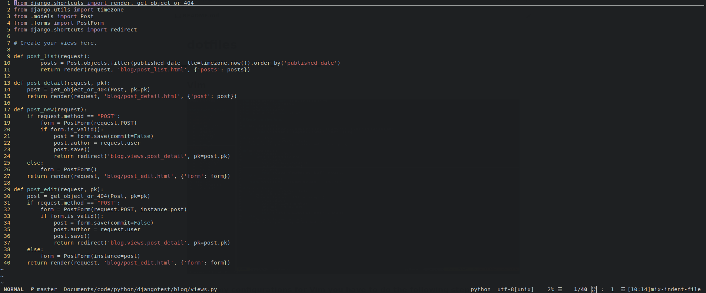

# **dotfiles**
This is a repository with my configuration files 

## Vim

To use my configurations for Vim you have to do the following steps:  

Before you start doing this, you'll need download the [Nerd Font][font-install].

    1. Clone this repository to your machine with:  
    > git clone https://github.com/nivaldogmelo/dotfiles.git  

    2. Copy the /vim/colors/soft-theme.vim to your  .vim/colors/  (if it doesn't exist, create one)
    
    3. Copy the /vim/.vimrc to your ~/ (If you already have one, just add the content to your .vimrc, making necessary changes)

    4. Open vim and run :PluginInstall

    5. Enjoy
    

[font-install]: https://github.com/ryanoasis/nerd-fonts#font-installation
