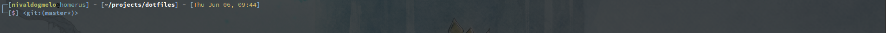

# **dotfiles**
This is a repository with my configuration files 

## Vim

### To use my configurations for Vim you have to do the following steps:  

Before you start doing this, you'll need Install the [Vundle][vundle].

1. Download the *[vimrc]* from the repository and put on your *~/* (If you already have one, just add the content to your .vimrc, making necessary changes)

2. Open vim and run
    >:PluginInstall

Optional Steps:
- To use the YouComplete me Plugin, follow the tutorial on the [YouCompleteMe][YCM] git page
- To use wakatime plugin, you'll need create an account on [Wakatime][wakatime] and setup API Key
    

[vundle]: https://github.com/VundleVim/Vundle.vim
[vimrc]: https://raw.githubusercontent.com/nivaldogmelo/dotfiles/master/vim/.vimrc
[YCM]: https://github.com/Valloric/YouCompleteMe#full-installation-guide
[wakatime]: https://wakatime.com

## Zsh

### To use my configurations for Zsh you have to do the following steps:  

Before you start doing this, you'll need Install the [zsh][zsh]
Also you need to install the [oh-my-zsh][oh-my-zsh].

1. Download the *[zshrc]* from the repository and put on your *~/* (If you already have one, just add the content to your .zshrc, making necessary changes)

2. To enable syntax highlight you need to run `git clone https://github.com/zsh-users/zsh-syntax-highlighting.git ${ZSH_CUSTOM:-~/.oh-my-zsh/custom}/plugins/zsh-syntax-highlighting`
    
3. Run `source .zshrc`

[vundle]: https://github.com/VundleVim/Vundle.vim
[vimrc]: https://raw.githubusercontent.com/nivaldogmelo/dotfiles/master/vim/.vimrc
[YCM]: https://github.com/Valloric/YouCompleteMe#full-installation-guide
[wakatime]: https://wakatime.com
[zsh]: https://github.com/robbyrussell/oh-my-zsh/wiki/Installing-ZSH
[oh-my-zsh]: https://github.com/robbyrussell/oh-my-zsh 
